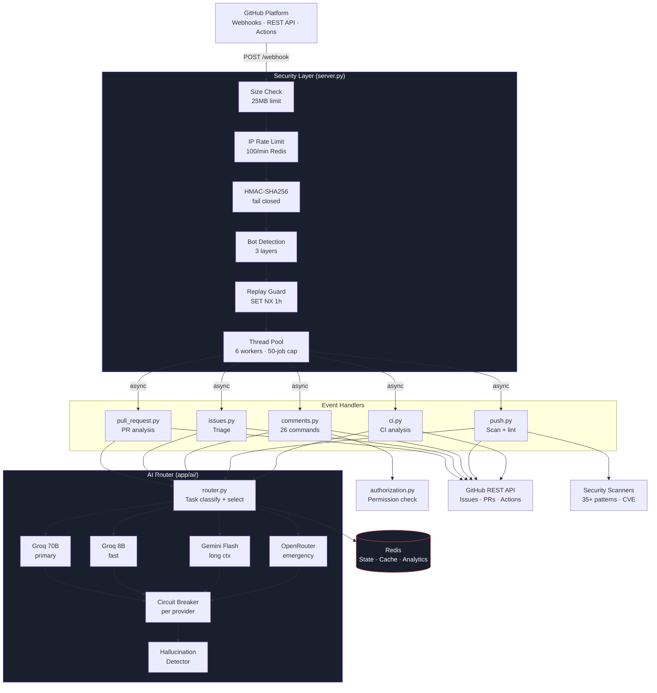
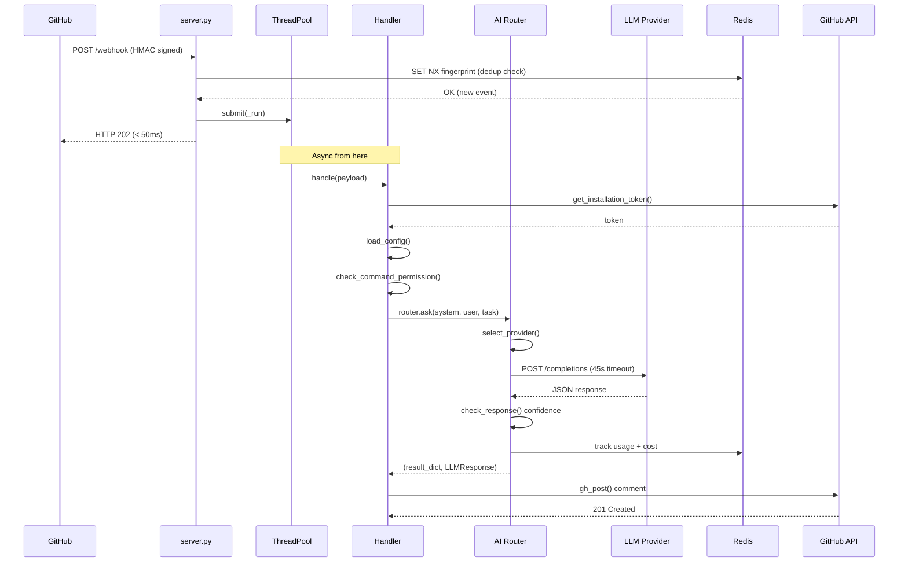
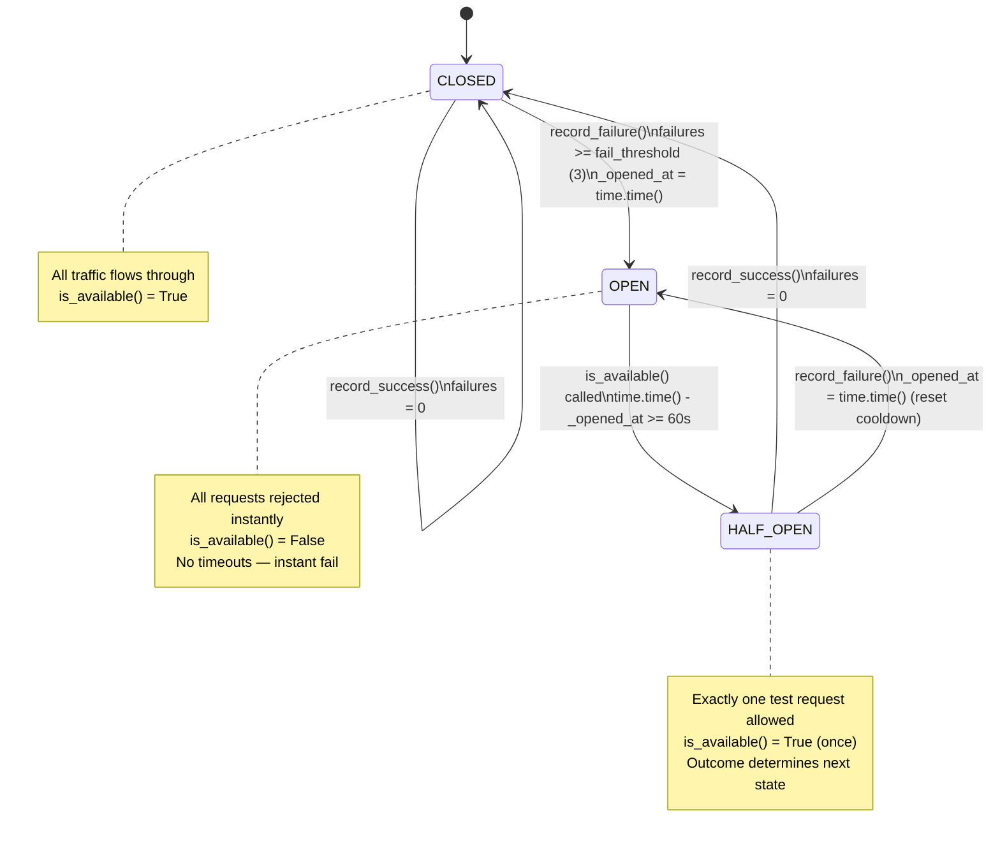

# System Diagrams

> All architecture, flow, sequence, and state diagrams for GitHub Autopilot.
> ASCII diagrams render in any terminal or text editor.
> Mermaid diagrams render natively on GitHub.

---

## Table of Contents

1. [Diagram 1 — Full System Architecture](#diagram-1--full-system-architecture)
2. [Diagram 2 — Security Pipeline (Request Lifecycle)](#diagram-2--security-pipeline-request-lifecycle)
3. [Diagram 3 — AI Routing Decision Tree](#diagram-3--ai-routing-decision-tree)
4. [Diagram 4 — Autofix Engine Flow](#diagram-4--autofix-engine-flow)
5. [Diagram 5 — Circuit Breaker State Machine](#diagram-5--circuit-breaker-state-machine)
6. [Diagram 6 — Data Flow to Redis](#diagram-6--data-flow-to-redis)
7. [Diagram 7 — Version Timeline v1 → v4](#diagram-7--version-timeline-v1--v4)
8. [Mermaid — System Architecture](#mermaid--system-architecture)
9. [Mermaid — Request Lifecycle Sequence](#mermaid--request-lifecycle-sequence)
10. [Mermaid — Circuit Breaker State Machine](#mermaid--circuit-breaker-state-machine)

---

## Diagram 1 — Full System Architecture

```
┌──────────────────────────────────────────────────────────────────────────────────┐
│                               GITHUB PLATFORM                                    │
│                                                                                  │
│   Webhooks    REST API    GraphQL    Secret Scanning    Actions    Marketplace   │
└──────────────────────────────────┬───────────────────────────────────────────────┘
                                   │  POST /webhook
                                   │  X-Hub-Signature-256: sha256=...
                                   ▼
╔══════════════════════════════════════════════════════════════════════════════════╗
║                            SECURITY LAYER  (server.py)                          ║
║                                                                                  ║
║  ┌─────────────┐  ┌──────────────────┐  ┌────────────────────────────────────┐  ║
║  │ [1] Size    │  │ [2] IP rate limit │  │ [3] HMAC-SHA256                   │  ║
║  │ > 25MB?     │  │ > 100 req/min?   │  │ empty secret → REJECT (not bypass) │  ║
║  │ → HTTP 413  │  │ → HTTP 429       │  │ → HTTP 401                        │  ║
║  └─────────────┘  └──────────────────┘  └────────────────────────────────────┘  ║
║  ┌────────────────┐  ┌──────────────────────────┐  ┌──────────────────────────┐  ║
║  │ [4] JSON parse │  │ [5] Bot sender detection │  │ [6] Replay protection    │  ║
║  │ → HTTP 400    │  │ [bot] suffix, type=Bot    │  │ SHA-256 fingerprint      │  ║
║  └────────────────┘  │ → HTTP 200 skip          │  │ Redis SET NX, TTL 1h     │  ║
║                       └──────────────────────────┘  │ → HTTP 200 skip (dedup) │  ║
║                                                       └──────────────────────────┘  ║
║  [7] ThreadPoolExecutor (max 6 workers, 50-job cap) → ACK HTTP 202 immediately  ║
╚══════════════════════════════════╤═══════════════════════════════════════════════╝
                                   │  async — GitHub already has its ACK
               ┌───────────────────┼──────────────────────┬─────────────────┐
               ▼                   ▼                      ▼                 ▼
     ┌──────────────────┐  ┌──────────────┐  ┌────────────────────┐  ┌──────────┐
     │  pull_request.py │  │  issues.py   │  │   comments.py      │  │ push.py  │
     │                  │  │              │  │                    │  │ ci.py    │
     │ PR analysis      │  │ Triage       │  │ 26 slash commands  │  │          │
     │ Blast radius     │  │ Auto-label   │  │ /fix  /autofix     │  │ Secrets  │
     │ Code review      │  │ Welcome msg  │  │ /merge /rollback   │  │ Deps     │
     │ Test gaps        │  │ Questions    │  │ /perf /arch        │  │ Lint     │
     └────────┬─────────┘  └──────┬───────┘  └─────────┬──────────┘  └────┬─────┘
              └───────────────────┴──────────────────────┴─────────────────┘
                                            │
                               ┌────────────▼──────────────┐
                               │      authorization.py      │
                               │   Restricted commands only │
                               │   GitHub collaborator API  │
                               │   write/maintain/admin     │
                               │   5-min RLock cache        │
                               └────────────┬──────────────┘
                                            │
                                            ▼
╔══════════════════════════════════════════════════════════════════════════════════╗
║                            AI ROUTER LAYER  (app/ai/)                           ║
║                                                                                  ║
║  Task classification → Provider selection → Sanitize → Call → Parse → Validate  ║
║                                                                                  ║
║  ┌────────────────┐  ┌────────────────┐  ┌──────────────────┐  ┌────────────┐  ║
║  │   Groq 70B     │─►│   Groq 8B     │─►│  Gemini Flash    │─►│ OpenRouter │  ║
║  │   primary      │  │   fast tasks   │  │  long context    │  │ emergency  │  ║
║  │   standard +   │  │   12K req/day  │  │  1M token ctx    │  │ 200/day    │  ║
║  │   deep tasks   │  │               │  │  1.5K req/day    │  │            │  ║
║  │   5K req/day   │  └────────────────┘  └──────────────────┘  └────────────┘  ║
║  └────────────────┘                                                              ║
║                                                                                  ║
║  ┌─────────────────────────────────────────────────────────────────────────────┐ ║
║  │  Circuit Breaker per provider: CLOSED → OPEN → HALF_OPEN → CLOSED          │ ║
║  │  3 failures → open · 60s cooldown · one test request · reset on success    │ ║
║  └─────────────────────────────────────────────────────────────────────────────┘ ║
║                                                                                  ║
║  ┌─────────────────────────────────────────────────────────────────────────────┐ ║
║  │  Hallucination Detector: confidence score on every response                 │ ║
║  │  < 0.70: add warning footer · < 0.50: retry next provider · < 0.30: block  │ ║
║  └─────────────────────────────────────────────────────────────────────────────┘ ║
╚══════════════════════════════════╤═══════════════════════════════════════════════╝
                                   │
              ┌────────────────────┼───────────────────────┐
              ▼                    ▼                       ▼
   ╔═════════════════╗   ╔════════════════════╗   ╔══════════════════════╗
   ║      REDIS      ║   ║   GITHUB REST API  ║   ║  SECURITY SCANNERS   ║
   ║                 ║   ║                    ║   ║                      ║
   ║  Idempotency    ║   ║  Issues · PRs      ║   ║  enhanced_secrets    ║
   ║  IP rate limit  ║   ║  Comments          ║   ║  35+ patterns        ║
   ║  Cmd rate limit ║   ║  Labels            ║   ║  Entropy gating      ║
   ║  Analytics      ║   ║  Releases          ║   ║  False-pos filter    ║
   ║  Snapshots      ║   ║  Actions/Workflows ║   ║  Dedup alerts        ║
   ║  LLM budget     ║   ║  Collaborator API  ║   ║                      ║
   ║  CI patterns    ║   ║  Security APIs     ║   ║  dependencies.py     ║
   ║  Secret dedup   ║   ║  Checks/Runs       ║   ║  scanner.py (CodeQL) ║
   ╚═════════════════╝   ╚════════════════════╝   ╚══════════════════════╝
```

---

## Diagram 2 — Security Pipeline (Request Lifecycle)

```
                            POST /webhook arrives
                                     │
                    ╔════════════════▼══════════════════╗
                    ║      STAGE 1 — SIZE CHECK         ║
                    ║   Content-Length > 25MB?          ║──YES──► HTTP 413
                    ╚════════════════╤══════════════════╝
                                     │ NO
                    ╔════════════════▼══════════════════╗
                    ║    STAGE 2 — IP RATE LIMIT        ║
                    ║   > 100 req/min from this IP?     ║──YES──► HTTP 429
                    ║   Redis: webhook_rl:{ip}:{minute} ║
                    ╚════════════════╤══════════════════╝
                                     │ within limit
                    ╔════════════════▼══════════════════╗
                    ║    STAGE 3 — HMAC-SHA256           ║
                    ║   WEBHOOK_SECRET empty?            ║──YES──► HTTP 401
                    ║   Header missing or wrong prefix?  ║──YES──► HTTP 401
                    ║   hmac.compare_digest fails?       ║──YES──► HTTP 401
                    ║   (constant-time comparison)       ║
                    ╚════════════════╤══════════════════╝
                                     │ valid
                    ╔════════════════▼══════════════════╗
                    ║    STAGE 4 — JSON PARSE            ║
                    ║   request.get_json(force=True)     ║──FAIL─► HTTP 400
                    ╚════════════════╤══════════════════╝
                                     │ parsed
                    ╔════════════════▼══════════════════╗
                    ║    STAGE 5 — BOT DETECTION        ║
                    ║   sender.type == "Bot"?           ║
                    ║   login ends with [bot]?          ║──YES──► HTTP 200 skip
                    ║   login in OWN_BOT_LOGINS?        ║         (not 401)
                    ╚════════════════╤══════════════════╝
                                     │ human sender
                    ╔════════════════▼══════════════════╗
                    ║    STAGE 6 — REPLAY PROTECTION    ║
                    ║   SHA-256 fingerprint              ║
                    ║   Redis SET NX, TTL 1h             ║──YES──► HTTP 200 skip
                    ║   Fingerprint already exists?      ║         (dedup)
                    ╚════════════════╤══════════════════╝
                                     │ new event
                    ╔════════════════▼══════════════════╗
                    ║    STAGE 7 — THREAD POOL          ║
                    ║   pending >= 50?                   ║──YES──► HTTP 202 DROP
                    ║   Submit to ExecutorPool           ║──OK───► HTTP 202 ✓
                    ╚════════════════╤══════════════════╝
                                     │ ACK returned < 50ms
                                     │ async processing begins
                                     ▼
                              handler.handle(payload)
```

---

## Diagram 3 — AI Routing Decision Tree

```
router.ask(system, user, task) called
               │
               ▼
  ┌────────────────────────┐
  │  _sanitize() inputs    │
  │  blocklist scan        │
  │  system: max 3,000 chr │
  │  user:   max 8,000 chr │
  └───────────┬────────────┘
              │
              ▼
  ┌────────────────────────┐
  │  TASK_MAP lookup       │
  │                        │
  │  fix_command → standard│
  │  issue_label → fast    │
  │  pr_analysis → deep    │
  │  large_pr    → long    │
  └───────────┬────────────┘
              │
              ▼
  ┌────────────────────────────────────────────────────────┐
  │                PROVIDER SELECTION                      │
  │                                                        │
  │  tier == standard or deep?                             │
  │    Groq 70B available AND usage < 80%? ──YES──► use it │
  │    Groq 8B  available AND usage < 80%? ──YES──► use it │
  │    Gemini   available AND usage < 80%? ──YES──► use it │
  │                                                        │
  │  tier == fast?                                         │
  │    Groq 8B  available AND usage < 80%? ──YES──► use it │
  │    Groq 70B available AND usage < 80%? ──YES──► use it │
  │    Gemini   available AND usage < 80%? ──YES──► use it │
  │                                                        │
  │  tier == long?                                         │
  │    Gemini   available AND usage < 80%? ──YES──► use it │
  │    Groq 70B available AND usage < 80%? ──YES──► use it │
  │                                                        │
  │  Any tier — last resort:                               │
  │    OpenRouter available?               ──YES──► use it │
  │                                                        │
  │  No candidates?                        ──────► AllProvidersDown
  └───────────────────────────┬────────────────────────────┘
                              │ provider selected
                              ▼
  ┌────────────────────────┐
  │  provider.ask()        │
  │  HTTP call to LLM API  │
  │  timeout: 45 seconds   │
  └───────────┬────────────┘
              │
     ┌────────┴────────┐
     │                 │
   success           failure / timeout
     │                 │
     ▼                 ▼
  record_success()  record_failure(reason)
  _extract_json()   failures >= 3 → circuit OPEN
     │              try next provider in chain
     ▼
  check_response()
  confidence score
     │
  ┌──┴────────────────────┐
  │  confidence >= 0.70?  │──YES──► return (dict, LLMResponse)
  │  confidence 0.50-0.69?│──────► add warning footer, return
  │  confidence < 0.50?   │──────► retry next provider
  │  confidence < 0.30?   │──────► all providers tried → post error
  └───────────────────────┘
              │
  _log_and_track()
  Redis: requests + tokens + cost
              │
              ▼
  return (result_dict, LLMResponse)
```

---

## Diagram 4 — Autofix Engine Flow

```
User posts: /autofix [optional: path/to/file.py]
                         │
                         ▼
          ┌──────────────────────────────┐
          │   Permission check           │──DENIED──► "⛔ write access required"
          │   write/maintain/admin only  │
          └──────────────┬───────────────┘
                         │ ALLOWED
                         ▼
          ┌──────────────────────────────┐
          │   File candidate selection   │
          │   1. explicit path argument  │
          │   2. path mentioned in issue │
          │   3. recently modified files │
          └────────┬─────────────────────┘
                   │
          ┌────────▼──────────────┐
          │  _is_allowed(path)?   │──NO──► "Cannot autofix — protected file"
          │  ALLOWED_EXTENSIONS   │       e.g. server.py, auth.py
          │  BLOCKED_PATHS        │
          └────────┬──────────────┘
                   │ YES
                   ▼
          ┌────────────────────────┐
          │  _fetch_file()         │──404──► "File not found in repository"
          │  gh_get contents API   │
          │  decode base64         │
          └────────┬───────────────┘
                   │
          ┌────────▼───────────────────┐
          │  _safe_excerpt()           │
          │  max 16,000 chars          │
          │  add TRUNCATION_MARKER     │
          │  if file was cut           │
          └────────┬───────────────────┘
                   │
          ┌────────▼───────────────────────────────┐
          │  STAGE 3 — Fix Plan Generation         │
          │  router.ask(system, user, task=fix)    │
          │  Returns: root_cause, fix_description  │
          └────────┬──────────────────┬────────────┘
          {"raw":...}?                │ valid JSON
               │                     ▼
          log WARNING          ┌────────────────────────────────┐
          abort                │  STAGE 4 — Fix Application     │
                               │  router.ask() full file        │
                               │  Returns: fixed_content        │
                               └────────┬───────────────────────┘
                                        │
                              ┌─────────▼──────────────┐
                              │  Safety Guards          │
                              │                         │
                              │  {"raw":...}?          │──YES──► log WARNING
                              │  → prose not JSON      │         return original
                              │                         │
                              │  fixed == ""?          │──YES──► log WARNING
                              │  → empty response      │         return original
                              │                         │
                              │  len(fixed) < 70%      │
                              │  of original?          │──YES──► log WARNING
                              │  → likely truncated    │         return original
                              └─────────┬──────────────┘
                                        │ PASSED all guards
                                        ▼
                              ┌────────────────────────┐
                              │  STAGE 5 — Branch      │
                              │  _create_branch()      │──KeyError──► GitHubError
                              │  name: autopilot/fix/  │              caught cleanly
                              │     {issue}/{timestamp}│
                              └────────┬───────────────┘
                                       │
                              ┌────────▼───────────────┐
                              │  _commit_file()        │──409──► "File changed, retry"
                              │  gh_put contents API   │
                              │  requires current SHA  │
                              └────────┬───────────────┘
                                       │
                              ┌────────▼───────────────┐
                              │  _open_pr()            │──422──► "Branch exists"
                              │  Closes #{issue}       │
                              │  Draft: false          │
                              └────────┬───────────────┘
                                       │
                              ┌────────▼───────────────┐
                              │  Post summary comment  │
                              │  on original issue     │
                              └────────────────────────┘
                                       │
                                       ▼
                              ✅ PR opened, issue updated
```

---

## Diagram 5 — Circuit Breaker State Machine

```
                   ┌─────────────────────────────────────────┐
                   │              CLOSED                      │
                   │           (healthy)                      │◄──────────────────────┐
                   │                                          │                       │
                   │  • All requests flow through             │                       │
                   │  • failure counter: {0, 1, 2}            │                       │
                   │  • is_available() → True                 │                       │
                   └──────────────────────┬───────────────────┘                       │
                                          │ record_failure() called                   │
                                          │ failures >= fail_threshold (3)            │
                                          ▼                                           │ record_success()
                   ┌─────────────────────────────────────────┐                       │ failures reset to 0
                   │               OPEN                       │                       │ state → CLOSED
                   │           (tripped)                      │                       │
                   │                                          │                       │
                   │  • ALL requests rejected instantly       │                       │
                   │  • is_available() → False                │                       │
                   │  • _opened_at = time.time()              │                       │
                   │    (NOT 0.0 — would skip cooldown)       │                       │
                   └──────────────────────┬───────────────────┘                       │
                                          │ time.time() - _opened_at                  │
                                          │ >= recovery_timeout (60s)                 │
                                          ▼                                           │
                   ┌─────────────────────────────────────────┐                       │
                   │            HALF_OPEN                     │                       │
                   │          (testing)                       │                       │
                   │                                          ├───────────────────────┘
                   │  • Exactly ONE test request allowed      │  success
                   │  • is_available() → True                 │
                   │  • If test fails:                        │
                   └──────────────────────┬───────────────────┘
                                          │ record_failure() during test
                                          │ _opened_at reset to time.time()
                                          ▼
                                    back to OPEN
                                  (another 60s cooldown)


  State transitions summary:
  ┌──────────┬──────────────────────────────────────────────┬────────────────┐
  │  From    │  Trigger                                     │  To            │
  ├──────────┼──────────────────────────────────────────────┼────────────────┤
  │ CLOSED   │ failures >= fail_threshold (3)               │ OPEN           │
  │ OPEN     │ time.time() - _opened_at >= 60s              │ HALF_OPEN      │
  │ HALF_OPEN│ record_success()                             │ CLOSED         │
  │ HALF_OPEN│ record_failure()                             │ OPEN (reset)   │
  └──────────┴──────────────────────────────────────────────┴────────────────┘
```

---

## Diagram 6 — Data Flow to Redis

```
Event received                   Handler executes                 AI call made
      │                                 │                               │
      ▼                                 ▼                               ▼
┌─────────────────┐         ┌─────────────────────┐        ┌──────────────────────┐
│ idem:{fp[:16]}  │         │ cmd_rl:{repo}:{user} │        │ llm:requests:{prov}  │
│ SET NX TTL 1h   │         │ :{hour_bucket}       │        │ :{date}              │
│                 │         │ INCR TTL 1h          │        │ INCR TTL 86400       │
│ dedup guard     │         │                      │        │                      │
│ prevents double │         │ 10 cmd/user/hr limit │        │ llm:tokens:{prov}    │
│ processing      │         └─────────────────────┘        │ :{date}              │
└─────────────────┘                                         │ INCR TTL 86400       │
                                                            │                      │
IP seen                                                     │ llm:cost_mc:{prov}   │
      │                                                     │ :{date}              │
      ▼                                                     │ INCR TTL 86400       │
┌─────────────────┐                                         └──────────────────────┘
│ webhook_rl:{ip} │
│ :{minute_bucket}│         Secret found on push            Snapshot taken
│ INCR TTL 60s    │               │                               │
│                 │               ▼                               ▼
│ 100 req/min cap │   ┌───────────────────────────┐  ┌───────────────────────────┐
└─────────────────┘   │ secret_reported:{repo}    │  │ snapshot:{repo}:{snap_id} │
                       │ :{dedup_key}              │  │ SET TTL 7d                │
                       │ SET NX TTL 1h             │  │                           │
                       │                           │  │ snapshot_index:{repo}     │
                       │ prevents duplicate alerts │  │ ordered JSON list         │
                       └───────────────────────────┘  └───────────────────────────┘


Analytics written                CI failure tracked
      │                                │
      ▼                                ▼
┌──────────────────────────────────────────────────────┐
│ analytics:{repo}:cmd:{name}:{date}  INCR             │
│ analytics:{repo}:prs_merged:{date}  INCR             │
│ analytics:{repo}:review_scores:{w}  LPUSH            │
│ analytics:{repo}:issue_hours:{w}    LPUSH            │
│                                                      │
│ ci:failures:{repo}:{check}:{date}   INCR TTL 86400  │
└──────────────────────────────────────────────────────┘
```

---

## Diagram 7 — Version Timeline v1 → v4

```
   Initial             AI Layer            Intelligence            Current
    │                   │                   │                        │
    ▼                   ▼                   ▼                        ▼
────●───────────────────●───────────────────●────────────────────────●────────►
    │                   │                   │                        │
    │ Flask webhook      │ Multi-provider    │ Hallucination detect   │ Analytics
    │ server            │ LLM router        │ Confidence scoring     │ /report
    │                   │                   │                        │
    │ threading         │ Groq 70B + 8B     │ PR blast radius        │ /autofix
    │                   │                   │ /impact                │ engine
    │ Bot-spam          │ Circuit breakers  │                        │
    │ prevention        │                   │ /secfull               │ /perf /arch
    │                   │ Gemini Flash      │                        │
    │ SHA-256           │ fallback          │ CI failure handler     │ Vector context
    │ deduplication     │                   │                        │ (Qdrant)
    │                   │ OpenRouter        │ Retry + backoff        │
    │                   │ emergency         │                        │ Learning
    │                   │                   │ /health endpoint       │ system
    │                   │                   │                        │
    │                   │                   │ Repo snapshots         │ 26 slash
    │                   │                   │ /rollback              │ commands
    │                   │                   │                        │
    │                   │                   │                        │ Security
    │                   │                   │                        │ hardening:
    │                   │                   │                        │ HMAC fix
    │                   │                   │                        │ auth enforce
    │                   │                   │                        │ thread pool
    │                   │                   │                        │ 35+ patterns
    │                   │                   │                        │ Full test suite
    │                   │                   │                        │
   "it works"          "it's smart"        "it's reliable"         "it's production"
```

---

## Mermaid — System Architecture



---

## Mermaid — Request Lifecycle Sequence



---

## Mermaid — Circuit Breaker State Machine



